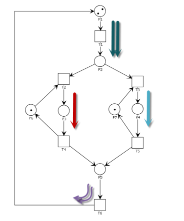

# Programación Concurrente 2024
## Trabajo Práctico Final

### Condiciones
* El trabajo es grupal, de 5 alumnos (grupo de 4 es la excepción).
* La defensa del trabajo se coordinará con el grupo respecto a modalidad presencial o videoconferencia.
* La evaluación es individual (hay una calificación particular para cada integrante).
* Solo se corrigen los trabajos que hayan sido subidos al aula virtual (LEV).
* Los problemas de concurrencia deben estar correctamente resueltos y explicados.
* El trabajo debe implementarse en lenguaje Java.
* Se evaluará la utilización de objetos y colecciones, como así también la explicación de los conceptos relacionados a la programación concurrente.

### Red de Petri Sistema de Agencia de Viajes


*Figura 1*

### Enunciado
En la Figura 1 se observa una red de Petri que modela un sistema de agencia de viajes.
Las plazas {P1, P4, P6, P7, P10} representan recursos compartidos en el sistema.
La plaza {P0} es una plaza idle que corresponde al buffer de entrada de clientes de la agencia.
La plaza {P2} representa el ingreso a la agencia.
La plaza {P3} representa la sala de espera de la agencia.
Las plazas {P5, P8} representan los estados en los cuales se realiza la gestión de las reservas.
La plaza {P9} representa la espera de los clientes para pasar por el agente que aprueba o rechaza las reservas.
En la plaza {P12} se modela la cancelación de la reserva.
En las plazas {P11, P13} se modela la confirmación y el pago respectivamente de la reserva.
En la plaza {P14} se modela la instancia previa a que el cliente se retire.

### Propiedades de la Red
* Es necesario determinar con una herramienta (simulador Ej: Petrinator, Pipe), la cual deberá justificar, las propiedades de la red (deadlock, vivacidad, seguridad). Cada propiedad debe ser interpretada para esta red particular.
* Indicar cual o cuales son los invariantes de plaza y los invariantes de transición de la red. Realizar una breve descripción de lo que representan en el modelo.

### Implementación
Es necesario implementar un monitor de concurrencia para la simulación y ejecución del modelo:
* Realizar una tabla, con los estados del sistema.
* Realizar una tabla, con los eventos del sistema.
* Determinar la cantidad de hilos necesarios para la ejecución del sistema con el mayor paralelismo posible (ver Referencias *1):
  * Caso 1: si el invariante de transición tiene un conflicto, con otro invariante, debe haber un hilo encargado de la ejecución de la/s transición/es anterior/es al conflicto y luego un hilo por invariante.
  * Caso 2: si el invariante de transición presenta un join, con otro invariante de transición, luego del join debe haber tantos hilos, como token simultáneos en la plaza, encargados de las transiciones restantes dado que hay un solo camino.
  * Realizar un gráfico donde pueda observarse las responsabilidades de cada hilo con diferentes colores. A modo de ejemplo se observa en la figura 2 una red y cómo presentar lo solicitado, las flechas coloreadas representan cada tipo y cantidad de hilos.



*Figura 2*

El programa debe tener la siguiente interfaz, y debe ser implementada por la clase Monitor desarrollada.

```java
public interface MonitorInterface {
    boolean fireTransition(int transition);
}
```

Cabe destacar también que el método `fireTransition` del monitor debe ser el único método público que expone la clase Monitor.

### Tiempo
Una vez implementado el monitor de concurrencia, con el sistema funcionando, se deberá implementar la semántica temporal. Las transiciones {T1, T4, T5, T8, T9, T10} son transiciones temporales. Implementarlas y asignarles un tiempo (a elección del grupo) en milisegundos.
Se debe hacer un análisis temporal tanto analítico como práctico (ejecutando el proyecto múltiples veces), justificando los resultados obtenidos. Además, es necesario también variar los tiempos elegidos, analizar los resultados y obtener conclusiones.

### Políticas
Es necesario para el modelado del sistema implementar políticas que resuelvan los conflictos. Se requiere considerar dos casos (ejecutados y analizados por separado e independientes uno de otro):
1. **Una política balanceada:**
    * La cantidad de clientes atendidos por el agente de reservas superior (plaza P6), debe ser equitativo a la cantidad de clientes atendidos por el agente de reservas inferior (plaza P7). Esto se debe corroborar al finalizar la ejecución mostrando la cantidad de clientes atendidos por cada agente de reservas.
    * La cantidad de reservas canceladas debe ser equitativa a la cantidad de reservas confirmadas.
2. **Una política de procesamiento priorizada:**
    * Se debe priorizar al agente de reservas superior (plaza P6). El 75% de las reservas deben ser creadas por dicho agente.
    * Se debe priorizar la confirmación de reservas, obteniendo al finalizar, un 80% del total de reservas confirmadas.

### Requerimientos
1) Implementar la red de Petri de la Figura 1 haciendo uso de una herramienta, ej: PIPE. Verificar todas sus propiedades.
2) El proyecto debe ser modelado con objetos en Java, haciendo uso de un monitor de concurrencia para guiar la ejecución de la red de Petri.
3) Implementar un objeto Política que cumpla con los objetivos establecidos en el apartado Políticas.
4) Hacer el diagrama de clases que modele el sistema.
5) Hacer el diagrama de secuencia que muestre el disparo exitoso de una transición que esté sensibilizada, mostrando el uso de la política.
6) Indicar la cantidad de hilos necesarios para la ejecución y justificar de acuerdo a lo mencionado en el apartado Implementación (ver Referencias *1).
7) Realizar múltiples ejecuciones con 186 invariantes completados (para cada ejecución), y demostrar con los resultados obtenidos:
   a) Cuán equitativa es la política implementada en el balance de carga en los invariantes.
   b) La cantidad de cada tipo de invariante, justificando el resultado.
8) Registrar los resultados del punto 7) haciendo uso de un archivo de log para su posterior análisis.
9) Hacer un análisis de tiempos, de acuerdo a lo mencionado en el apartado Tiempo.
10) Mostrar e interpretar los invariantes de plazas y transiciones que posee la red.
11) Verificar el cumplimiento de los invariantes de plazas luego de cada disparo de la red.
12) Verificar el cumplimiento de los invariantes de transiciones mediante el análisis de un archivo log de las transiciones disparadas al finalizar la ejecución. El análisis de los invariantes debe hacerse mediante expresiones regulares. Tip: www.regex.com - www.debuggex.com.
13) El programa debe poseer una clase Main que al correrla, inicie el programa.

### Entregables
a) Un archivo de imagen con el diagrama de clases, en buena calidad.
b) Un archivo de imagen con el diagrama de secuencias, en buena calidad.
c) Un archivo de imagen con la red de Petri, en buena calidad.
d) El archivo fuente de la herramienta con la que se modeló la red.
e) El código fuente Java (proyecto) de la resolución del ejercicio.
f) Un informe obligatorio que documente lo realizado, explique el código, los criterios adoptados y que explique los resultados obtenidos.

Subir al LEV el trabajo **TODOS** los participantes del grupo.

### Fecha de entrega
11 de Junio de 2024

### Referencias bibliográficas
*1 : Artículo cantidad de hilos.
https://www.researchgate.net/publication/358104149_Algoritmos_para_determinar_cantidad_y_responsabilidad_de_hilos_en_sistemas_embebidos_modelados_con_Redes_de_Petri_S_3_PR1
