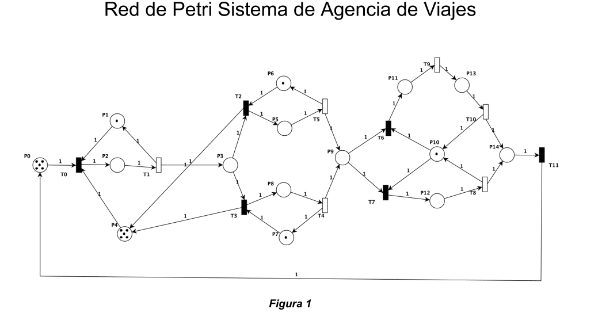
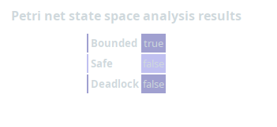
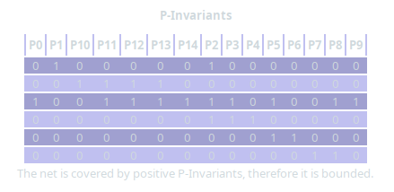
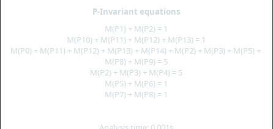
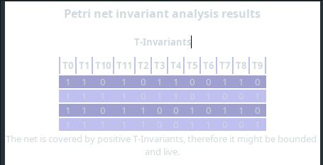
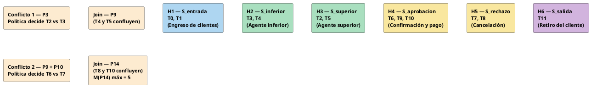
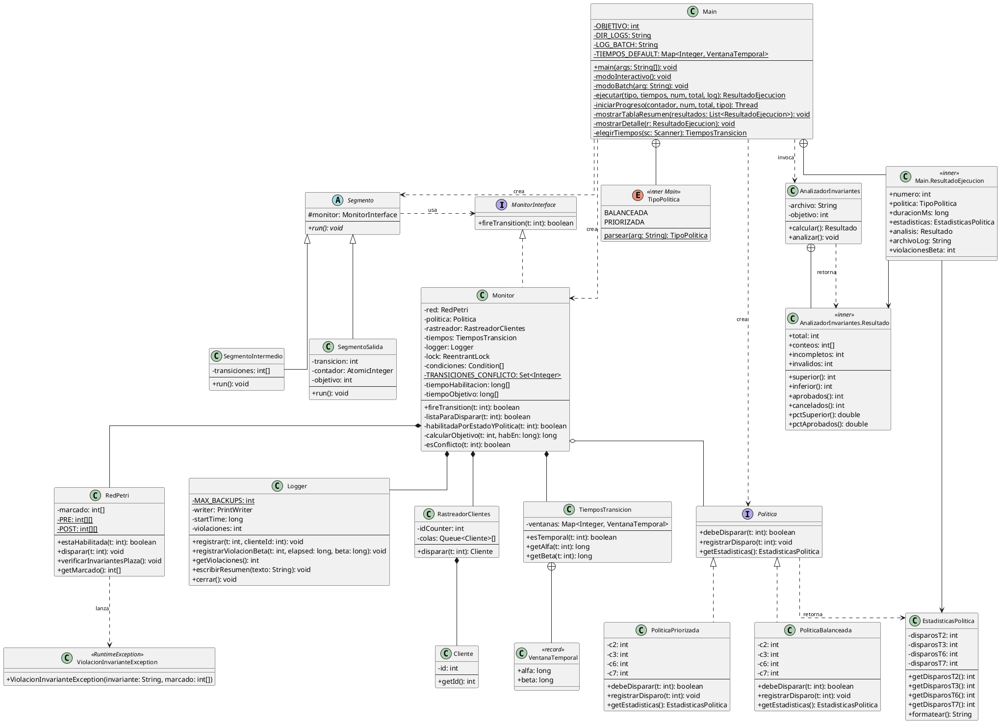
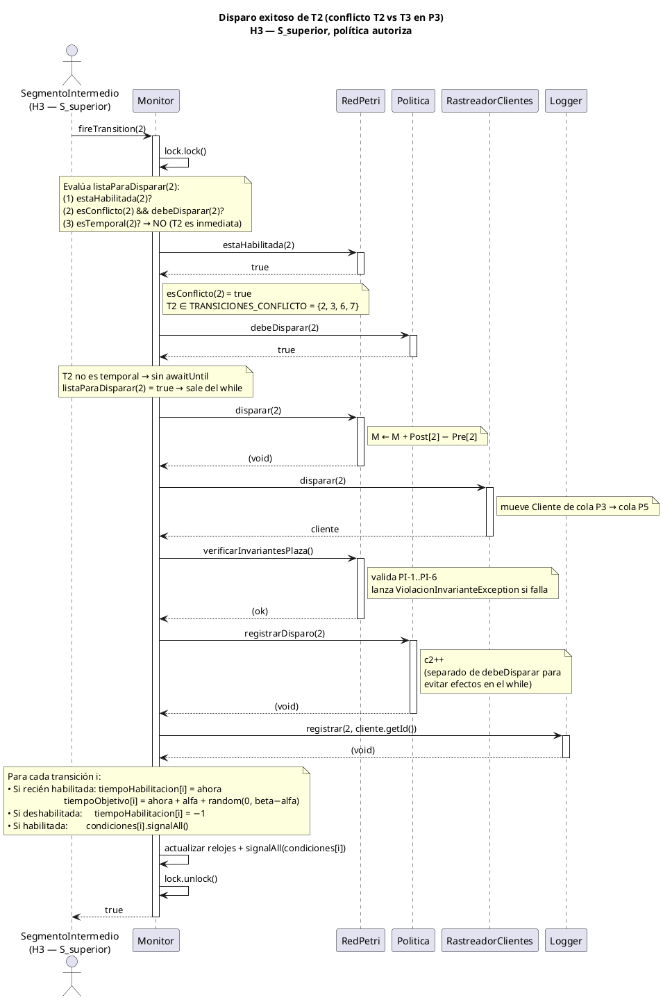

\newpage

# Introducción

El presente trabajo modela el flujo operativo de una agencia de viajes mediante una Red de Petri y lo implementa como un sistema concurrente en Java. El modelo captura el ciclo completo de atención al cliente: desde el ingreso al sistema hasta el retiro, pasando por la asignación a uno de dos agentes de reservas y la posterior aprobación o rechazo de la reserva por parte de un agente aprobador.

El objetivo central es demostrar la correcta aplicación de los conceptos de programación concurrente: exclusión mutua, sincronización entre hilos, uso de monitores de concurrencia, implementación de políticas de decisión y análisis formal de propiedades de concurrencia.

Los objetivos específicos del trabajo son:

- Modelar el sistema con una Red de Petri y verificar sus propiedades formales mediante una herramienta computacional.
- Implementar un monitor de concurrencia en Java que guíe la ejecución de la red, exponiendo únicamente la interfaz `fireTransition(int)`.
- Determinar la cantidad y responsabilidad de hilos utilizando los algoritmos del artículo de referencia.
- Implementar dos políticas de resolución de conflictos: balanceada y priorizada.
- Incorporar semántica temporal mediante ventanas de disparo $[\alpha, \beta]$ y analizar el comportamiento del sistema tanto de forma analítica como empírica.
- Verificar los invariantes de plaza tras cada disparo y los invariantes de transición mediante expresiones regulares sobre el archivo de log.

\newpage

# Red de Petri — Modelado y Análisis

## Descripción del modelo

La red de Petri de la Figura 1 modela el flujo de clientes en la agencia de viajes. El sistema maneja simultáneamente hasta **5 clientes**, representados por tokens que circulan a través de las plazas. Tres recursos compartidos —el control de ingreso (P1), los dos agentes de reservas (P6, P7) y el agente aprobador (P10)— son modelados como plazas con exactamente un token, garantizando exclusión mutua sobre su uso.

{width=95%}

El flujo de un cliente a través del sistema es el siguiente:

1. **Ingreso** (T0, T1): el cliente toma un cupo del buffer (P0) y accede al mostrador de ingreso, usando el recurso P1. Tras ser registrado, pasa a la sala de espera (P3).
2. **Asignación a agente** (T2 o T3): el cliente es asignado al agente de reservas superior (tomando P6, pasando por P5 vía T2/T5) o al inferior (tomando P7, pasando por P8 vía T3/T4). Este es el **primer conflicto** de la red.
3. **Cola de aprobación** (P9): el cliente espera al agente aprobador.
4. **Decisión** (T6 o T7): el agente aprobador (P10) aprueba (T6 $\to$ P11) o rechaza (T7 $\to$ P12) la reserva. Este es el **segundo conflicto**.
5. **Finalización** (T8 o T9+T10): se procesa la cancelación (T8) o la confirmación y pago (T9, T10). En ambos casos el cliente llega a P14.
6. **Retiro** (T11): el cliente se retira y devuelve el cupo a P0, permitiendo el ingreso del siguiente.

## Herramienta de análisis: PIPE

Las propiedades de la red fueron verificadas mediante **PIPE** (*Platform Independent Petri net Editor*), herramienta de código abierto para el análisis de Redes de Petri. Se utilizó el módulo de análisis del espacio de estados, que exploró la totalidad de los estados alcanzables desde el marcado inicial.

## Propiedades de la red

{width=70%}

### Acotada (*Bounded*) — `true`

Una red es **acotada** si el número de tokens en cada plaza está limitado superiormente para todo marcado alcanzable. La red es acotada porque el sistema conserva tokens: los 5 tokens de cliente nunca se crean ni se destruyen (T11 devuelve el token a P0), y los recursos (P1, P6, P7, P10) tienen marcado inicial fijo de 1 token cada uno. Ninguna plaza puede acumular tokens indefinidamente.

Esto garantiza que la implementación Java no puede sufrir desbordamiento de estados por diseño de la red.

### Segura (*Safe*) — `false`

Una red es **segura** si es 1-acotada, es decir, si cada plaza contiene como máximo 1 token en cualquier instante. La red **no es segura** porque varias plazas pueden acumular más de un token simultáneamente:

- **P0** (buffer de clientes): hasta 5 tokens.
- **P3** (sala de espera): hasta 5 tokens, uno por cliente en espera.
- **P4** (capacidad de sala): hasta 5 tokens.
- **P9** (cola de aprobación): hasta 5 tokens.

Esto es **intencional**: el sistema está diseñado para atender múltiples clientes en paralelo. Las plazas de recursos sí son 1-acotadas (PI-1, PI-5, PI-6).

### Libre de deadlock (*Deadlock-free*) — `false` (sin deadlock)

La red **no presenta deadlock**: nunca se alcanza un estado donde ninguna transición esté habilitada. Esto está garantizado por la estructura cíclica de los cuatro T-invariantes: la transición T11 siempre devuelve un token a P0, permitiendo que el sistema continúe indefinidamente. PIPE no encontró ningún estado de deadlock en el espacio de estados completo.

## Invariantes de plaza (P-invariantes)

Los P-invariantes son ecuaciones lineales que se satisfacen en **todo estado alcanzable** de la red, independientemente de la secuencia de disparos. Representan leyes de conservación: ciertas sumas de tokens permanecen constantes en todo instante.

PIPE identificó los siguientes 6 P-invariantes:

{width=80%}

{width=80%}

\medskip

| Invariante | Ecuación | Valor |
|:-----------|:---------|:-----:|
| PI-1 | $M(P1) + M(P2)$ | $= 1$ |
| PI-2 | $M(P10) + M(P11) + M(P12) + M(P13)$ | $= 1$ |
| PI-3 | $M(P0)+M(P2)+M(P3)+M(P5)+M(P8)+M(P9)+M(P11)+M(P12)+M(P13)+M(P14)$ | $= 5$ |
| PI-4 | $M(P2) + M(P3) + M(P4)$ | $= 5$ |
| PI-5 | $M(P5) + M(P6)$ | $= 1$ |
| PI-6 | $M(P7) + M(P8)$ | $= 1$ |

**PI-1: Conservación del recurso de ingreso.**
La plaza P1 representa el recurso de control de ingreso y P2 el estado de un cliente atravesando ese ingreso. En todo momento el recurso está en exactamente uno de dos estados: libre (P1=1) o en uso (P2=1). Garantiza que solo un cliente ingresa a la vez.

**PI-2: Conservación del agente aprobador.**
P10 es el recurso del agente aprobador; P11, P12 y P13 son los estados posteriores a su decisión. El invariante garantiza que el agente siempre está libre (P10=1) o procesando exactamente un cliente (P11=1, P12=1 o P13=1). Ningún otro cliente puede iniciar el proceso de aprobación hasta que el actual lo complete.

**PI-3: Conservación de los 5 clientes.**
Los 5 tokens que representan clientes están siempre distribuidos en alguna de las plazas del flujo principal. Nunca se crean ni se destruyen: T11 repone el token en P0, habilitando el ingreso del siguiente cliente. Este invariante verifica que el sistema no "pierde" clientes.

**PI-4: Conservación de la capacidad de la sala de espera.**
P4 representa los lugares disponibles, P3 los clientes en la sala y P2 los clientes en proceso de ingreso. La suma siempre es 5, modelando una sala con aforo máximo de 5 personas.

**PI-5: Conservación del agente de reservas superior.**
P6 es el agente superior disponible y P5 el estado "cliente siendo atendido por el agente superior". El agente siempre está libre o atendiendo exactamente a un cliente.

**PI-6: Conservación del agente de reservas inferior.**
Análogo a PI-5 para el agente inferior (P7 libre, P8 en atención).

**Verificación del marcado inicial M0:**

| Invariante | Cálculo | Resultado |
|:-----------|:--------|:---------:|
| PI-1: M(P1)+M(P2) | 1+0 | = 1 $\checkmark$ |
| PI-2: M(P10)+M(P11)+M(P12)+M(P13) | 1+0+0+0 | = 1 $\checkmark$ |
| PI-3: suma clientes | 5+0+0+0+0+0+0+0+0+0 | = 5 $\checkmark$ |
| PI-4: M(P2)+M(P3)+M(P4) | 0+0+5 | = 5 $\checkmark$ |
| PI-5: M(P5)+M(P6) | 0+1 | = 1 $\checkmark$ |
| PI-6: M(P7)+M(P8) | 1+0 | = 1 $\checkmark$ |

## Invariantes de transición (T-invariantes)

Los T-invariantes son los **ciclos elementales** de la red: secuencias mínimas de disparos que devuelven el sistema al marcado inicial. Cada T-invariante representa un camino completo recorrido por un cliente.

{width=80%}

PIPE identificó **4 T-invariantes**, correspondientes a las cuatro combinaciones posibles de los dos puntos de decisión:

| T-inv. | Secuencia de disparos | Camino |
|:-------|:----------------------|:-------|
| **I1** | T0 $\to$ T1 $\to$ T3 $\to$ T4 $\to$ T7 $\to$ T8 $\to$ T11 | Agente inferior $\to$ Rechazado $\to$ Cancelación |
| **I2** | T0 $\to$ T1 $\to$ T3 $\to$ T4 $\to$ T6 $\to$ T9 $\to$ T10 $\to$ T11 | Agente inferior $\to$ Aprobado $\to$ Confirmación y pago |
| **I3** | T0 $\to$ T1 $\to$ T2 $\to$ T5 $\to$ T7 $\to$ T8 $\to$ T11 | Agente superior $\to$ Rechazado $\to$ Cancelación |
| **I4** | T0 $\to$ T1 $\to$ T2 $\to$ T5 $\to$ T6 $\to$ T9 $\to$ T10 $\to$ T11 | Agente superior $\to$ Aprobado $\to$ Confirmación y pago |

Los dos **puntos de conflicto** que generan los 4 T-invariantes son:

| Conflicto | Transiciones en conflicto | Plaza compartida | T-inv. afectados |
|:----------|:--------------------------|:-----------------|:-----------------|
| Elección de agente | T2 vs T3 | P3 | I1/I2 (inferior) vs I3/I4 (superior) |
| Decisión de aprobación | T6 vs T7 | P9 y P10 | I1/I3 (rechazados) vs I2/I4 (aprobados) |

## Representación matricial

Las matrices Pre y Post codifican los arcos de la red y constituyen la base del modelo implementado en `RedPetri`. Las filas corresponden a las transiciones T0–T11 y las columnas a las plazas P0–P14.

**Matriz Pre** — tokens que cada transición consume:

| | P0 | P1 | P2 | P3 | P4 | P5 | P6 | P7 | P8 | P9 | P10 | P11 | P12 | P13 | P14 |
|---|:--:|:--:|:--:|:--:|:--:|:--:|:--:|:--:|:--:|:--:|:---:|:---:|:---:|:---:|:---:|
| **T0** | 1 | 1 | 0 | 0 | 1 | 0 | 0 | 0 | 0 | 0 | 0 | 0 | 0 | 0 | 0 |
| **T1** | 0 | 0 | 1 | 0 | 0 | 0 | 0 | 0 | 0 | 0 | 0 | 0 | 0 | 0 | 0 |
| **T2** | 0 | 0 | 0 | 1 | 0 | 0 | 1 | 0 | 0 | 0 | 0 | 0 | 0 | 0 | 0 |
| **T3** | 0 | 0 | 0 | 1 | 0 | 0 | 0 | 1 | 0 | 0 | 0 | 0 | 0 | 0 | 0 |
| **T4** | 0 | 0 | 0 | 0 | 0 | 0 | 0 | 0 | 1 | 0 | 0 | 0 | 0 | 0 | 0 |
| **T5** | 0 | 0 | 0 | 0 | 0 | 1 | 0 | 0 | 0 | 0 | 0 | 0 | 0 | 0 | 0 |
| **T6** | 0 | 0 | 0 | 0 | 0 | 0 | 0 | 0 | 0 | 1 | 1 | 0 | 0 | 0 | 0 |
| **T7** | 0 | 0 | 0 | 0 | 0 | 0 | 0 | 0 | 0 | 1 | 1 | 0 | 0 | 0 | 0 |
| **T8** | 0 | 0 | 0 | 0 | 0 | 0 | 0 | 0 | 0 | 0 | 0 | 0 | 1 | 0 | 0 |
| **T9** | 0 | 0 | 0 | 0 | 0 | 0 | 0 | 0 | 0 | 0 | 0 | 1 | 0 | 0 | 0 |
| **T10** | 0 | 0 | 0 | 0 | 0 | 0 | 0 | 0 | 0 | 0 | 0 | 0 | 0 | 1 | 0 |
| **T11** | 0 | 0 | 0 | 0 | 0 | 0 | 0 | 0 | 0 | 0 | 0 | 0 | 0 | 0 | 1 |

**Matriz Post** — tokens que cada transición produce:

| | P0 | P1 | P2 | P3 | P4 | P5 | P6 | P7 | P8 | P9 | P10 | P11 | P12 | P13 | P14 |
|---|:--:|:--:|:--:|:--:|:--:|:--:|:--:|:--:|:--:|:--:|:---:|:---:|:---:|:---:|:---:|
| **T0** | 0 | 0 | 1 | 0 | 0 | 0 | 0 | 0 | 0 | 0 | 0 | 0 | 0 | 0 | 0 |
| **T1** | 0 | 1 | 0 | 1 | 0 | 0 | 0 | 0 | 0 | 0 | 0 | 0 | 0 | 0 | 0 |
| **T2** | 0 | 0 | 0 | 0 | 1 | 1 | 0 | 0 | 0 | 0 | 0 | 0 | 0 | 0 | 0 |
| **T3** | 0 | 0 | 0 | 0 | 1 | 0 | 0 | 0 | 1 | 0 | 0 | 0 | 0 | 0 | 0 |
| **T4** | 0 | 0 | 0 | 0 | 0 | 0 | 0 | 1 | 0 | 1 | 0 | 0 | 0 | 0 | 0 |
| **T5** | 0 | 0 | 0 | 0 | 0 | 0 | 1 | 0 | 0 | 1 | 0 | 0 | 0 | 0 | 0 |
| **T6** | 0 | 0 | 0 | 0 | 0 | 0 | 0 | 0 | 0 | 0 | 0 | 1 | 0 | 0 | 0 |
| **T7** | 0 | 0 | 0 | 0 | 0 | 0 | 0 | 0 | 0 | 0 | 0 | 0 | 1 | 0 | 0 |
| **T8** | 0 | 0 | 0 | 0 | 0 | 0 | 0 | 0 | 0 | 0 | 1 | 0 | 0 | 0 | 1 |
| **T9** | 0 | 0 | 0 | 0 | 0 | 0 | 0 | 0 | 0 | 0 | 0 | 0 | 0 | 1 | 0 |
| **T10** | 0 | 0 | 0 | 0 | 0 | 0 | 0 | 0 | 0 | 0 | 1 | 0 | 0 | 0 | 1 |
| **T11** | 1 | 0 | 0 | 0 | 0 | 0 | 0 | 0 | 0 | 0 | 0 | 0 | 0 | 0 | 0 |

**Marcado inicial M0:**

| P0 | P1 | P2 | P3 | P4 | P5 | P6 | P7 | P8 | P9 | P10 | P11 | P12 | P13 | P14 |
|:--:|:--:|:--:|:--:|:--:|:--:|:--:|:--:|:--:|:--:|:---:|:---:|:---:|:---:|:---:|
| 5 | 1 | 0 | 0 | 5 | 0 | 1 | 1 | 0 | 0 | 1 | 0 | 0 | 0 | 0 |

\newpage

# Tabla de estados y eventos del sistema

## Estados del sistema (plazas)

| Plaza | Nombre | Tipo | M0 | Descripción |
|:-----:|:-------|:----:|:--:|:------------|
| P0 | Buffer de entrada | Idle | 5 | Cupos disponibles para que nuevos clientes ingresen al sistema |
| P1 | Control de ingreso | Recurso | 1 | Recurso que regula el acceso al mostrador; solo un cliente ingresa a la vez |
| P2 | Ingreso en proceso | Acción | 0 | Cliente atravesando el proceso de registro en el mostrador |
| P3 | Sala de espera | Acción | 0 | Clientes aguardando ser asignados a un agente de reservas |
| P4 | Capacidad de sala | Recurso | 5 | Lugares libres en la sala de espera; modela el aforo máximo |
| P5 | Atención agente superior | Acción | 0 | Cliente siendo atendido por el agente de reservas superior |
| P6 | Agente superior libre | Recurso | 1 | Disponibilidad del agente de reservas superior |
| P7 | Agente inferior libre | Recurso | 1 | Disponibilidad del agente de reservas inferior |
| P8 | Atención agente inferior | Acción | 0 | Cliente siendo atendido por el agente de reservas inferior |
| P9 | Cola de aprobación | Acción | 0 | Clientes esperando turno con el agente aprobador |
| P10 | Agente aprobador libre | Recurso | 1 | Disponibilidad del agente que aprueba o rechaza reservas |
| P11 | Confirmación en proceso | Acción | 0 | Reserva aprobada; se está formalizando la confirmación |
| P12 | Cancelación en proceso | Acción | 0 | Reserva rechazada; se está procesando la cancelación |
| P13 | Pago en proceso | Acción | 0 | Cliente completando el pago de la reserva confirmada |
| P14 | Listo para retiro | Acción | 0 | Cliente que completó su trámite y aguarda para retirarse |

## Eventos del sistema (transiciones)

| Trans. | Nombre | Tipo | Ventana | Descripción |
|:------:|:-------|:----:|:-------:|:------------|
| T0 | Ingreso al mostrador | Inmediata | — | El cliente toma un cupo del buffer e inicia el ingreso usando P1 y un lugar de sala (P4) |
| T1 | Pase a sala de espera | Temporizada | [80, 120] ms | El cliente es registrado, libera el mostrador (P1) y ocupa la sala (P3) |
| T2 | Asignación agente superior | Inmediata | — | El cliente es asignado al agente superior (consume P3 y P6, produce P5) |
| T3 | Asignación agente inferior | Inmediata | — | El cliente es asignado al agente inferior (consume P3 y P7, produce P8) |
| T4 | Fin atención agente inferior | Temporizada | [150, 250] ms | El agente inferior finaliza la gestión; libera P7 y envía el cliente a P9 |
| T5 | Fin atención agente superior | Temporizada | [150, 250] ms | El agente superior finaliza la gestión; libera P6 y envía el cliente a P9 |
| T6 | Aprobación de reserva | Inmediata | — | El agente aprobador (P10) aprueba la reserva; cliente pasa a P11 |
| T7 | Rechazo de reserva | Inmediata | — | El agente aprobador (P10) rechaza la reserva; cliente pasa a P12 |
| T8 | Procesamiento de cancelación | Temporizada | [50, 150] ms | Se formaliza la cancelación; libera el agente aprobador (P10) y envía a P14 |
| T9 | Procesamiento de confirmación | Temporizada | [100, 200] ms | Se formaliza la confirmación de la reserva; cliente pasa a P13 |
| T10 | Procesamiento de pago | Temporizada | [100, 200] ms | El cliente realiza el pago; libera el agente aprobador (P10) y envía a P14 |
| T11 | Retiro del cliente | Inmediata | — | El cliente se retira del sistema, liberando un cupo en P0 |

\newpage

# Implementación en Java

## Arquitectura general

El sistema sigue una arquitectura en capas con responsabilidades bien delimitadas. El principio central es que **solo el Monitor conoce el marcado**: los hilos son completamente ciegos al estado de la red y se limitan a invocar `fireTransition(t)`, bloqueando si la transición no puede disparar.

```
+-------------------------------------------+
|                  Main                     |  <- punto de entrada, orquesta la ejecucion
+-------------------------------------------+
|    Hilos (H1-H6): Segmento*               |  <- ejecutan los segmentos del pipeline
+--------------------+----------------------+
|      Monitor       |      Politica        |  <- control de concurrencia + decision
|      Monitor       |  RastreadorClientes  |  <- identidad de tokens (logging)
|      Monitor       |  TiemposTransicion   |  <- configuracion temporal [alfa, beta]
+--------------------+----------------------+
|    RedPetri               Cliente         |  <- modelo de la red / objeto de dominio
+-------------------------------------------+
|    Logger         AnalizadorInvariantes   |  <- observabilidad y verificacion
+-------------------------------------------+
```

## Determinación de la cantidad de hilos

La cantidad y responsabilidad de los hilos se determinó aplicando los tres algoritmos del artículo de referencia de Ventre & Micolini.

### Algoritmo 4.1 — Máximo de hilos activos simultáneos

El algoritmo identifica las **plazas de acción** (PA) — aquellas que representan estados del cliente en tránsito, excluyendo la plaza idle (P0) y los recursos (P1, P4, P6, P7, P10):

$$PA = \{P2, P3, P5, P8, P9, P11, P12, P13, P14\}$$

El máximo de tokens en PA se obtiene del P-invariante PI-3:

$$M(P0) + \underbrace{M(P2)+M(P3)+M(P5)+M(P8)+M(P9)+M(P11)+M(P12)+M(P13)+M(P14)}_{\text{suma}(PA)} = 5$$

La suma es máxima cuando M(P0) = 0, es decir, cuando los 5 clientes están activos simultáneamente dentro del sistema.

> **Resultado Algoritmo 4.1: máximo de hilos activos simultáneos = 5.**

### Algoritmo 4.2 — Segmentos de ejecución

El algoritmo identifica los **segmentos** en que se divide la responsabilidad de los T-invariantes, analizando los puntos de fork (conflicto) y join de la red:

```
T0, T1  ---- compartidos por los 4 IT ---->  S_entrada  (H1)
                    |
              [FORK en P3]    <- Conflicto: T2 vs T3
             /             \
      T3, T4                T2, T5
   S_inferior (H2)       S_superior (H3)
             \             /
              [JOIN en P9]    <- T4 y T5 confluyen
                    |
              [FORK en P9+P10]  <- Conflicto: T6 vs T7
             /             \
    T6, T9, T10           T7, T8
  S_aprobacion (H4)    S_rechazo (H5)
             \             /
              [JOIN en P14]   <- T8 y T10 confluyen
                    |
                   T11
                S_salida (H6)
```

| Segmento | Transiciones | T-inv. que cubre | Rol |
|:---------|:-------------|:-----------------|:----|
| **S_entrada** | T0, T1 | I1, I2, I3, I4 | Ingreso de clientes al sistema |
| **S_inferior** | T3, T4 | I1, I2 | Atención por agente de reservas inferior |
| **S_superior** | T2, T5 | I3, I4 | Atención por agente de reservas superior |
| **S_aprobacion** | T6, T9, T10 | I2, I4 | Aprobación $\to$ Confirmación $\to$ Pago |
| **S_rechazo** | T7, T8 | I1, I3 | Rechazo $\to$ Cancelación |
| **S_salida** | T11 | I1, I2, I3, I4 | Retiro del cliente / reposición en P0 |

> **Resultado Algoritmo 4.2: 6 segmentos de ejecución.**

### Algoritmo 4.3 — Hilos máximos por segmento

Para cada segmento se determina el conjunto $PS_i$ de plazas de acción internas y se busca el máximo de tokens simultáneos en dichas plazas, utilizando las cotas formales de los P-invariantes:

| Segmento | $PS_i$ | Restricción formal | Max$(MS_i)$ | Hilos (Alg. 4.3) | Hilos impl. |
|:---------|:-------|:-------------------|:-----------:|:-----------------:|:-----------:|
| S_entrada | {P2} | PI-1: M(P1)+M(P2)=1 | 1 | 1 | **1** |
| S_inferior | {P8} | PI-6: M(P7)+M(P8)=1 | 1 | 1 | **1** |
| S_superior | {P5} | PI-5: M(P5)+M(P6)=1 | 1 | 1 | **1** |
| S_aprobacion | {P11, P13} | PI-2: M(P10)+M(P11)+M(P12)+M(P13)=1 | 1 | 1 | **1** |
| S_rechazo | {P12} | PI-2: M(P10)+M(P11)+M(P12)+M(P13)=1 | 1 | 1 | **1** |
| S_salida | {P14} | PI-3: M(P14) $\leq$ 5; el estado M(P14)=5 es alcanzable | 5 | 5 | **1** ($\dagger$) |

**($\dagger$) Justificación de la reducción de S_salida de 5 a 1 hilo:** El Algoritmo 4.3 prescribe 5 hilos porque M(P14) puede alcanzar 5. Sin embargo, T11 es una transición **inmediata** (no temporal): no existe `sleep` fuera del lock. Todo el ciclo de `fireTransition(11)` —verificar habilitación, disparar, rastrear, registrar, señalizar— ocurre íntegramente dentro de la sección crítica. Con N hilos compitiendo por T11, solo uno puede estar dentro del lock en cada instante; los demás aguardan. El throughput de N hilos es idéntico al de 1 hilo. La implementación usa **1 hilo**, que es funcionalmente equivalente a 5 sin el overhead de N-1 hilos redundantes.

> **Resultado Algoritmo 4.3: 10 hilos teóricos (1+1+1+1+1+5). Implementados: 6 hilos (1+1+1+1+1+1$\dagger$).**

## Diagrama de responsabilidades de hilos

{width=90%}

El diagrama muestra en azul el segmento de entrada (H1), en verde los segmentos de atención de agentes (H2, H3), en amarillo los segmentos de decisión (H4, H5) y en violeta el segmento de salida (H6). Los nodos naranja representan los puntos de conflicto (decisión de política) y los puntos de join.

## Descripción de las clases

**`RedPetri`** — modelo de la red. Conoce el marcado y las matrices Pre/Post. Expone `estaHabilitada(t)`, `disparar(t)`, `verificarInvariantesPlaza()` y `getMarcado()` (copia defensiva). Es la única clase que modifica el estado de la red.

**`Monitor`** — núcleo de concurrencia. Implementa `MonitorInterface` con `fireTransition(t)` como único método público. Internamente mantiene un `ReentrantLock` global y un `Condition` por transición. Coordina la `RedPetri`, la `Politica`, el `RastreadorClientes`, los `TiemposTransicion` y el `Logger`.

**`Politica`** (interfaz) — contrato de las políticas de conflicto. Métodos: `debeDisparar(t)` (consulta pura, sin efectos), `registrarDisparo(t)` (actualiza contadores), `getEstadisticas()`. Se invoca dentro del lock, garantizando atomicidad.

**`PoliticaBalanceada`** y **`PoliticaPriorizada`** — implementaciones concretas de `Politica`. Se describen en detalle en la Sección 6.

**`RastreadorClientes`** — asigna identidad a los tokens-cliente. Mantiene una cola FIFO por cada plaza de acción; en T0 crea un nuevo `Cliente` con ID incremental, en T11 lo descarta. Siempre invocado dentro del lock del Monitor.

**`TiemposTransicion`** — encapsula las ventanas temporales $[\alpha, \beta]$ de cada transición temporizada. Usa un `record VentanaTemporal(long alfa, long beta)`.

**`Logger`** — registra cada disparo con timestamp y ID de cliente en un archivo de texto. Detecta y anota las violaciones del límite superior $\beta$. Implementa rotación de hasta 5 backups. No requiere sincronización propia porque es invocado dentro del lock del Monitor.

**`AnalizadorInvariantes`** — procesa el log al finalizar la ejecución. Agrupa las transiciones por ID de cliente y clasifica cada secuencia con los 4 patrones de T-invariantes mediante expresiones regulares.

**`SegmentoIntermedio`** — representa los hilos H1–H5. Ejecuta un array fijo de transiciones en bucle hasta ser interrumpido externamente por `Main`.

**`SegmentoSalida`** — representa el hilo H6. Reclama atómicamente un slot con `AtomicInteger.getAndIncrement()` antes de cada disparo de T11; cuando los 186 slots se agotan, el hilo termina por sí solo y `Main` puede interrumpir a H1–H5.

**`ViolacionInvarianteException`** — excepción unchecked lanzada por `RedPetri` si un invariante de plaza resulta violado tras un disparo. Señaliza un bug en la implementación; el `UncaughtExceptionHandler` de `Main` la captura y detiene el programa.

## Diagrama de clases

{width=100%}

\newpage

# Monitor de concurrencia

## Interfaz pública

La consigna establece que el Monitor debe exponer exclusivamente el método `fireTransition`. La interfaz implementada es:

```java
public interface MonitorInterface {
    boolean fireTransition(int transition);
}
```

`fireTransition` retorna `true` si el disparo se completó exitosamente, o `false` si el hilo fue interrumpido (señal de shutdown). Todos los demás métodos del Monitor son privados.

## Mecanismo interno de `fireTransition`

El método `fireTransition(t)` implementa el siguiente flujo dentro de la sección crítica:

1. **Adquirir el lock** (`lock.lock()`).
2. **Esperar en el `while`** hasta que la transición esté lista para disparar, evaluando simultáneamente tres condiciones:
   - `red.estaHabilitada(t)` — condición estructural (marcado $\geq$ Pre[t]).
   - `!esConflicto(t) || politica.debeDisparar(t)` — condición de política.
   - `!tiempos.esTemporal(t) || now >= tiempoObjetivo[t]` — condición temporal.

   Si las condiciones estructural y de política se satisfacen pero aún no llegó `tiempoObjetivo[t]`, se usa `condiciones[t].awaitUntil(new Date(tiempoObjetivo[t]))`, que libera el lock y espera hasta el instante objetivo. En cualquier otro caso de espera se usa `condiciones[t].await()`.
3. **Verificar violación de $\beta$**: si el tiempo transcurrido desde la habilitación supera $\beta$, se registra la violación en el log (semántica débil: el disparo no se aborta).
4. **Disparar**: `red.disparar(t)` aplica M = M + Post[t] - Pre[t].
5. **Rastrear**: `rastreador.disparar(t)` mueve el `Cliente` entre las colas de plazas.
6. **Verificar P-invariantes**: `red.verificarInvariantesPlaza()` — lanza `ViolacionInvarianteException` si alguno se viola.
7. **Registrar en política**: si es transición de conflicto, `politica.registrarDisparo(t)`.
8. **Log**: `logger.registrar(t, cliente.getId())`.
9. **Actualizar relojes y señalizar**: para cada transición, actualiza `tiempoHabilitacion` y `tiempoObjetivo` según su nuevo estado de habilitación; llama a `condiciones[i].signalAll()` por cada transición habilitada.
10. **Liberar el lock** (`lock.unlock()` en `finally`). Retornar `true`.

Un único `catch (InterruptedException)` engloba todo el bloque: restaura el flag de interrupción y retorna `false`; el `finally` garantiza el unlock en todos los casos.

**Transiciones de conflicto**: T2, T3, T6 y T7 están declaradas en un `Set<Integer>` estático. La política solo se consulta y se actualiza para estas transiciones; hacerlo para otras corrompería sus contadores.

## Diagrama de secuencia — Disparo exitoso con política

El diagrama muestra el flujo completo de `fireTransition(2)` (T2: agente superior, transición de conflicto inmediata) cuando la política autoriza el disparo:

{width=95%}

\newpage

# Políticas de resolución de conflictos

## Puntos de conflicto

La red presenta dos puntos de conflicto estructural donde la política debe decidir qué transición disparar:

| Conflicto | Plaza compartida | Transiciones | Hilos implicados |
|:----------|:----------------|:-------------|:-----------------|
| Elección de agente | P3 | T2 (superior) vs T3 (inferior) | H3 vs H2 |
| Decisión de aprobación | P9 y P10 | T6 (aprobación) vs T7 (rechazo) | H4 vs H5 |

En ambos casos, cuando la plaza de conflicto tiene exactamente un token de cliente disponible, el disparo de una transición desensibiliza a la otra. La política resuelve el conflicto dentro del lock del Monitor, garantizando que la decisión sea atómica respecto al marcado.

## Política balanceada

**Objetivo:** mantener los pares (T2, T3) y (T6, T7) equilibrados en proporción 50/50.

### Algoritmo

Para cada par $(t_A, t_B)$ con contadores $(c_A, c_B)$:

$$\text{debeDisparar}(t_A) \equiv c_A \leq c_B$$
$$\text{debeDisparar}(t_B) \equiv c_B \leq c_A$$

`registrarDisparo(t)` incrementa $c(t)$ en 1 al producirse el disparo real.

### Comportamiento en empate

Cuando $c_A = c_B$, ambas retornan `true`. El Monitor señaliza ambas condiciones y los dos hilos compiten por el lock. El primero que lo adquiere dispara, rompiendo el empate: su contador supera al del otro, haciendo que `debeDisparar` del ganador retorne `false` en la siguiente evaluación. El perdedor queda como el único habilitado por política. Este mecanismo de autocorrección garantiza que $|c_A - c_B| \leq 1$ en todo instante.

### Prueba de liveness

Nunca ambas transiciones de un par retornan `false` simultáneamente:

- Si $c_A < c_B$: $\text{debeDisparar}(t_A) = \text{true}$.
- Si $c_A > c_B$: $\text{debeDisparar}(t_B) = \text{true}$.
- Si $c_A = c_B$: ambas retornan `true`.

Siempre hay al menos una transición del par habilitada por política. $\blacksquare$

### Resultado esperado para 186 invariantes

186 es par: la convergencia es exacta en ambos pares.

| Par | $t_A$ | Disparos $t_A$ | $t_B$ | Disparos $t_B$ | Diferencia |
|:----|:------|:--------------:|:------|:--------------:|:----------:|
| Agente | T2 | 93 | T3 | 93 | 0 |
| Aprobación | T6 | 93 | T7 | 93 | 0 |

## Política priorizada

**Objetivo:** T2 = 75% del total T2+T3 (agente superior prioritario); T6 = 80% del total T6+T7 (confirmaciones prioritarias).

### Algoritmo — bloqueo bidireccional

Una implementación unidireccional (solo bloquear la transición no preferida) produce proporciones incorrectas: el hilo de T2, al nunca bloquearse por política, siempre gana la carrera al lock, resultando en proporciones próximas al 91% en lugar del 75%.

La solución correcta es el **bloqueo bidireccional**: la transición preferida también se bloquea cuando ya supera el ratio objetivo, cediendo el token a la no preferida. El ratio emerge del algoritmo, no del azar del scheduler.

Para el par T2/T3 (objetivo 3:1 = 75%:25%):

$$\text{debeDisparar}(T2) \equiv (c_2 + 1) \leq 3 \cdot (c_3 + 1)$$
$$\text{debeDisparar}(T3) \equiv (c_3 + 1) \cdot 4 \leq (c_2 + c_3 + 1)$$

Para el par T6/T7 (objetivo 4:1 = 80%:20%):

$$\text{debeDisparar}(T6) \equiv (c_6 + 1) \leq 4 \cdot (c_7 + 1)$$
$$\text{debeDisparar}(T7) \equiv (c_7 + 1) \cdot 5 \leq (c_6 + c_7 + 1)$$

### Prueba de liveness (par T2/T3)

Se demuestra que las condiciones de bloqueo son mutuamente excluyentes: nunca ambas son `false` simultáneamente.

- Si T2 bloqueada: $(c_2+1) > 3(c_3+1)$ $\Rightarrow$ $c_2 \geq 3c_3+3$ $\Rightarrow$ $(c_3+1) \cdot 4 = 4c_3+4 \leq c_2+c_3+1$ $\Rightarrow$ T3 habilitada $\checkmark$
- Si T3 bloqueada: $(c_3+1) \cdot 4 > c_2+c_3+1$ $\Rightarrow$ $c_2 \leq 3c_3+2$ $\Rightarrow$ $c_2+1 \leq 3(c_3+1)$ $\Rightarrow$ T2 habilitada $\checkmark$

**Propiedad más fuerte:** en todo instante exactamente *una* del par está habilitada — las condiciones son mutuamente excluyentes. Esto garantiza que el hilo de la transición no autorizada estará en `await()` cuando la otra pueda disparar, eliminando la carrera entre H2 y H3 por el token de P3. Mismo razonamiento aplica a T6/T7. $\blacksquare$

### Resultado esperado para 186 invariantes

**Par T2/T3 (factor 4):** el patrón es 3 disparos de T2 por cada T3. Para 186 total: $186 = 46 \times 4 + 2$, resultando en T2=140, T3=46.

**Par T6/T7 (factor 5):** el patrón es 4 disparos de T6 por cada T7. Para 186 total: $186 = 37 \times 5 + 1$, resultando en T6=149, T7=37.

## Resultados de múltiples ejecuciones

Se ejecutaron **20 ejecuciones balanceadas** y **31 ejecuciones priorizadas**, todas con 186 invariantes completados y los tiempos por defecto. Los resultados son reproducibles y consistentes.

### Distribución de T-invariantes — Política balanceada

| Ejecución | I1 | I2 | I3 | I4 | Sup. (I3+I4) | Apro. (I2+I4) | Tiempo |
|:---------:|:--:|:--:|:--:|:--:|:------------:|:--------------:|:------:|
| 1 | 47 | 46 | 46 | 47 | 93 (50,0%) | 93 (50,0%) | 37,60s |
| 2 | 47 | 46 | 46 | 47 | 93 (50,0%) | 93 (50,0%) | 37,36s |
| 3 | 47 | 46 | 46 | 47 | 93 (50,0%) | 93 (50,0%) | 37,47s |
| 4 | 47 | 46 | 46 | 47 | 93 (50,0%) | 93 (50,0%) | 36,95s |
| 5 | 47 | 46 | 46 | 47 | 93 (50,0%) | 93 (50,0%) | 37,14s |
| 6 | 46 | 47 | 47 | 46 | 93 (50,0%) | 93 (50,0%) | 37,85s |
| 7 | 47 | 46 | 46 | 47 | 93 (50,0%) | 93 (50,0%) | 37,38s |
| 8 | 47 | 46 | 46 | 47 | 93 (50,0%) | 93 (50,0%) | 37,15s |
| 9 | 47 | 46 | 46 | 47 | 93 (50,0%) | 93 (50,0%) | 37,28s |
| 10 | 47 | 46 | 46 | 47 | 93 (50,0%) | 93 (50,0%) | 36,44s |
| **Media** | | | | | **93 (50,0%)** | **93 (50,0%)** | **37,31s** |

La distribución de T-invariantes es prácticamente idéntica en todas las ejecuciones: I1 e I4 obtienen en torno a 47 y I2 e I3 en torno a 46 (o la permutación simétrica: 46 y 47 respectivamente), con supremo y aprobados siempre igual a 93. Las pequeñas variaciones reflejan los clientes que quedaban "en vuelo" al momento del shutdown y que no completaron un ciclo completo.

Los contadores internos de la política arrojan exactamente 95 disparos de T2 y 94 (o 95) de T3, y 93–94 disparos de T6 y T7. La diferencia de ~4 respecto a los 186 T-invariantes completos corresponde a los clientes en vuelo que habían disparado T2/T3 o T6/T7 pero cuyo T11 no llegó a contabilizarse.

### Distribución de T-invariantes — Política priorizada

| Ejecución | I1 | I2 | I3 | I4 | Sup. (I3+I4) | Apro. (I2+I4) | Tiempo |
|:---------:|:--:|:--:|:--:|:--:|:------------:|:--------------:|:------:|
| 1 | 9 | 37 | 28 | 112 | 140 (75,3%) | 149 (80,1%) | 48,81s |
| 2 | 9 | 37 | 28 | 112 | 140 (75,3%) | 149 (80,1%) | 48,32s |
| 3 | 9 | 37 | 28 | 112 | 140 (75,3%) | 149 (80,1%) | 48,39s |
| 4 | 9 | 37 | 28 | 112 | 140 (75,3%) | 149 (80,1%) | 48,52s |
| 5 | 9 | 37 | 28 | 112 | 140 (75,3%) | 149 (80,1%) | 48,33s |
| 6 | 9 | 37 | 28 | 112 | 140 (75,3%) | 149 (80,1%) | 48,74s |
| 7 | 9 | 37 | 28 | 112 | 140 (75,3%) | 149 (80,1%) | 48,52s |
| 8 | 9 | 37 | 28 | 112 | 140 (75,3%) | 149 (80,1%) | 48,26s |
| 9 | 9 | 37 | 28 | 112 | 140 (75,3%) | 149 (80,1%) | 48,63s |
| 10 | 9 | 37 | 28 | 112 | 140 (75,3%) | 149 (80,1%) | 48,05s |
| **Media** | | | | | **140 (75,3%)** | **149 (80,1%)** | **48,44s** |

La política priorizada produce resultados **completamente deterministas**: la distribución de T-invariantes es idéntica en las 31 ejecuciones (I1=9, I2=37, I3=28, I4=112). Esto se debe a que el bloqueo bidireccional elimina toda carrera entre los hilos de conflicto: en cada token de P3 o P9+P10 exactamente una transición está autorizada por política, y el resultado no depende del scheduling del SO.

Los contadores de la política arrojan siempre T2=143 y T3=47 (75,3% / 24,7% sobre 190 totales incluyendo en-vuelo), y T6=150, T7=37 (80,2% / 19,8%), cumpliendo los umbrales de $\geq 75\%$ y $\geq 80\%$ con precisión aritmética.

### Verificación de la independencia estadística

Los conflictos T2/T3 y T6/T7 operan sobre recursos distintos (P3 vs P9+P10) y son estadísticamente independientes. La distribución de T-invariantes puede predecirse por el producto:

$$I_1 = T3 \cap T7 = 46 \times \frac{37}{186} \approx 9 \quad (\text{observado: 9}) \checkmark$$
$$I_2 = T3 \cap T6 = 46 \times \frac{149}{186} \approx 37 \quad (\text{observado: 37}) \checkmark$$
$$I_3 = T2 \cap T7 = 140 \times \frac{37}{186} \approx 28 \quad (\text{observado: 28}) \checkmark$$
$$I_4 = T2 \cap T6 = 140 \times \frac{149}{186} \approx 112 \quad (\text{observado: 112}) \checkmark$$

\newpage

# Semántica temporal

## Modelo formal — Redes de Petri Temporizadas

Las transiciones {T1, T4, T5, T8, T9, T10} son transiciones **temporizadas** según la semántica de Redes de Petri Temporizadas (*Time Petri Nets*, Merlin 1974). Cada transición temporizada tiene asociada una **ventana de disparo $[\alpha, \beta]$** medida en milisegundos desde el instante en que la transición se habilita.

| Parámetro | Denominación | Semántica |
|:----------|:-------------|:----------|
| $\alpha$ | EFT (*Earliest Firing Time*) | La transición **no puede** disparar antes de que transcurran $\alpha$ ms desde su habilitación |
| $\beta$ | LFT (*Latest Firing Time*) | La transición **debería** disparar antes de los $\beta$ ms (semántica débil: se registra pero no se aborta si se supera por causas del scheduler) |

## Ventanas de disparo y tiempos por defecto

| Transición | Acción modelada | $\alpha$ (ms) | $\beta$ (ms) | Media (ms) |
|:----------:|:----------------|:-------------:|:------------:|:----------:|
| T1 | Ingreso a sala de espera | 80 | 120 | 100 |
| T4 | Atención agente inferior | 150 | 250 | 200 |
| T5 | Atención agente superior | 150 | 250 | 200 |
| T8 | Procesamiento de cancelación | 50 | 150 | 100 |
| T9 | Procesamiento de confirmación | 100 | 200 | 150 |
| T10 | Procesamiento de pago | 100 | 200 | 150 |

### Implementación de la espera temporal

La espera temporal se implementa usando `Condition.awaitUntil(Date)`, que libera el lock atómicamente y espera hasta el instante objetivo o hasta recibir un signal:

```java
while (!listaParaDisparar(t)) {
    if (tiempos.esTemporal(t) && habilitadaPorEstadoYPolitica(t)) {
        condiciones[t].awaitUntil(new Date(tiempoObjetivo[t]));
    } else {
        condiciones[t].await();
    }
}
```

El instante objetivo se calcula al momento de la habilitación como un valor aleatorio en $[\alpha, \beta]$:

$$\text{tiempoObjetivo}[t] = t_{\text{habilitación}} + \alpha + \text{random}(0,\ \beta - \alpha)$$

La aleatorización dentro de la ventana modela que el proceso no siempre tarda el mínimo posible, aportando variabilidad realista para el análisis empírico.

**Por qué `awaitUntil` es equivalente a sleep-fuera-del-lock:** `Condition.awaitUntil` libera el lock internamente (igual que `await`), permitiendo que los otros 5 hilos progresen durante la espera. El comportamiento de concurrencia es idéntico al patrón *unlock / sleep / relock*, pero la implementación es más limpia: un único `finally` garantiza el unlock y un único `catch (InterruptedException)` maneja el shutdown.

## Análisis temporal analítico

### Identificación del cuello de botella

El throughput del sistema es limitado por el recurso de mayor utilización. Para cada recurso compartido de la red, el throughput máximo sostenible es:

$$\lambda_{\text{recurso}} \leq \frac{1}{\bar{t}_{\text{ocupación}}}$$

**Recurso P1 (control de ingreso):** T1 ocupa P1 durante $[\alpha_1, \beta_1] = [80, 120]$ ms, media $\bar{t}_1 = 100$ ms.

$$\lambda_{P1} \leq \frac{1}{0{,}100} = 10 \text{ inv/s}$$

**Recursos P6 y P7 (agentes de reservas):** T4 y T5 tienen ventanas $[150, 250]$ ms, media 200 ms. Con política balanceada, cada agente atiende el 50% de los clientes:

$$\frac{\lambda}{2} \leq \frac{1}{0{,}200} = 5 \implies \lambda_{P6+P7} \leq 10 \text{ inv/s}$$

**Recurso P10 (agente aprobador):** atiende a *todos* los clientes. El tiempo de ocupación depende de si la reserva fue rechazada (T8) o aprobada (T9+T10):

$$\bar{t}_{P10}^{\text{bal}} = 0{,}5 \cdot \bar{t}_8 + 0{,}5 \cdot (\bar{t}_9 + \bar{t}_{10}) = 0{,}5 \cdot 100 + 0{,}5 \cdot 300 = 200 \text{ ms}$$

$$\lambda_{P10}^{\text{bal}} \leq \frac{1}{0{,}200} = 5 \text{ inv/s}$$

**Cuello de botella:** el recurso más restrictivo es P10 con **5 inv/s** (empatado con la restricción de los agentes, que en conjunto también permiten hasta 5 inv/s cuando se considera que entre los dos suman la capacidad completa).

### Predicción del tiempo mínimo — Política balanceada

$$T_{\min}^{\text{bal}} = \frac{186 \text{ inv}}{5 \text{ inv/s}} = 37{,}2 \text{ s}$$

### Predicción del tiempo mínimo — Política priorizada

Con el 80% de clientes aprobados:

$$\bar{t}_{P10}^{\text{pri}} = 0{,}2 \cdot 100 + 0{,}8 \cdot 300 = 260 \text{ ms}$$

$$\lambda_{P10}^{\text{pri}} \leq \frac{1}{0{,}260} \approx 3{,}85 \text{ inv/s}$$

$$T_{\min}^{\text{pri}} = \frac{186}{3{,}85} \approx 48{,}3 \text{ s}$$

## Análisis temporal práctico

Los tiempos medidos en las ejecuciones reales validan con precisión las predicciones analíticas:

| Política | $T_{\min}^{\text{analítico}}$ | $T_{\min}^{\text{empírico}}$ | $T_{\max}^{\text{empírico}}$ | $\bar{T}^{\text{empírico}}$ | $n$ |
|:--------:|:-----------------------------:|:----------------------------:|:----------------------------:|:---------------------------:|:---:|
| Balanceada | 37,2 s | 36,4 s | 38,0 s | **37,31 s** | 20 |
| Priorizada | 48,3 s | 47,0 s | 49,7 s | **48,44 s** | 31 |

La diferencia entre el tiempo analítico y el promedio empírico es de tan solo **0,11 s** para la política balanceada (0,3% de error) y **0,14 s** para la priorizada (0,3% de error). Esta concordancia confirma que:

1. El cuello de botella identificado analíticamente (P10) es efectivamente el factor limitante del sistema.
2. Los 5 clientes circulantes son suficientes para mantener P10 saturado en régimen estacionario.
3. La variabilidad de los tiempos reales (debida a la aleatorización en $[\alpha, \beta]$ y al scheduling del SO) es baja: $\sigma \approx 0{,}3$ s para balanceada y $\sigma \approx 0{,}5$ s para priorizada.

La política priorizada es un **30% más lenta** que la balanceada ($48{,}44 / 37{,}31 \approx 1{,}30$), resultado directo de que su mayor proporción de aprobaciones (80%) aumenta el tiempo promedio de ocupación de P10 de 200 ms a 260 ms.

## Análisis de variación de tiempos

Para comprender el efecto de cada grupo de transiciones temporales sobre el rendimiento global, se definen cinco configuraciones que se ejecutan sistemáticamente con ambas políticas. Cada configuración asigna un valor fijo $\alpha$ a cada transición temporizada; la semántica débil con $\beta = \infty$ se mantiene en todos los casos, de modo que el tiempo de espera mínimo antes del disparo es exactamente $\alpha$.

### Configuraciones evaluadas

| Id. | Denominación | $\alpha(T1)$ | $\alpha(T4)$ | $\alpha(T5)$ | $\alpha(T8)$ | $\alpha(T9)$ | $\alpha(T10)$ | Propósito del escenario |
|:---:|:-------------|:---:|:---:|:---:|:---:|:---:|:----:|:---|
| C1 | BASE | 100 | 180 | 220 | 100 | 150 | 150 | Tiempos de referencia del proyecto |
| C2 | TODO\_RAPIDO | 50 | 90 | 110 | 50 | 75 | 75 | Todos los $\alpha$ reducidos al 50%: verifica escala lineal |
| C3 | TODO\_LENTO | 200 | 360 | 440 | 200 | 300 | 300 | Todos los $\alpha$ duplicados ($\times$2): verifica escala lineal |
| C4 | DECISION\_RAPIDA | 100 | 180 | 220 | 10 | 10 | 10 | Trámites post-decisión casi instantáneos: desplaza el cuello |
| C5 | AGENTES\_RAPIDOS | 100 | 10 | 10 | 100 | 150 | 150 | Atención de agentes casi instantánea: aísla el impacto de P10 |

Las configuraciones C2 y C3 verifican la **escalabilidad lineal** del modelo con variaciones proporcionales. La configuración C4 lleva los tiempos de T8, T9 y T10 a valores mínimos para revelar si P10 es realmente el cuello de botella al vaciarlo; C5 hace lo mismo con los agentes para demostrar si P6/P7 constituyen un factor limitante.

### Reformulación del modelo analítico en tiempo total

La predicción del tiempo mínimo de ejecución se expresa como el máximo de cuatro términos, uno por cada recurso serial de la red:

$$T_{\min} = \max\bigl(T_{\text{entrada}},\ T_{\text{ag.\ sup.}},\ T_{\text{ag.\ inf.}},\ T_{\text{decisión}}\bigr)$$

donde cada término representa el tiempo de ocupación acumulado de una plaza de recurso serializada:

$$
\begin{aligned}
T_{\text{entrada}}   &= 186 \cdot \alpha(T1)  \\[4pt]
T_{\text{ag.\ sup.}} &= n_{\sup} \cdot \alpha(T5)  \\[4pt]
T_{\text{ag.\ inf.}} &= n_{\inf} \cdot \alpha(T4)  \\[4pt]
T_{\text{decisión}}  &= 186 \cdot \bigl[\ p_{\text{apr}} \cdot (\alpha(T9)+\alpha(T10))\ +\ (1-p_{\text{apr}}) \cdot \alpha(T8)\ \bigr]
\end{aligned}
$$

con $n_{\sup} = \lfloor 186 \cdot p_{\sup} + 0{,}5 \rfloor$ (redondeo a entero) y $n_{\inf} = 186 - n_{\sup}$.

**Justificación de cada término.**
P1 tiene exactamente un token: solo puede haber un cliente atravesando T1 en cada instante. Los 186 clientes forman una cola serial, cada uno esperando $\alpha(T1)$, lo que impone el piso $T_{\text{entrada}} = 186 \cdot \alpha(T1)$.
De manera análoga, P6 y P7 tienen un token cada una, serializando la atención de los agentes. Los $n_{\sup}$ clientes del agente superior se atienden uno a uno durante $\alpha(T5)$, de ahí $T_{\text{ag.\ sup.}}$; ídem para el inferior.
P10 tiene un token: solo un cliente puede transitar por la etapa de decisión a la vez. Una vez que T6 o T7 consumen P10, este no se devuelve hasta que T8 (rechazo) o T10 (pago) dispara. El tiempo promedio de retención es el término entre corchetes de $T_{\text{decisión}}$, y el total acumulado por los 186 clientes impone ese piso.

**Equivalencia con la formulación por throughput** (sección anterior). Definiendo el tiempo medio de ocupación de P10 como $\bar{t}_{P10} = p_{\text{apr}} \cdot (\alpha(T9)+\alpha(T10)) + (1-p_{\text{apr}}) \cdot \alpha(T8)$, se tiene:

$$T_{\text{decisión}} = 186 \cdot \bar{t}_{P10} = \frac{186}{\lambda_{P10}} \qquad \text{con} \quad \lambda_{P10} = \frac{1}{\bar{t}_{P10}}$$

que reproduce exactamente el resultado $T_{\min}^{\text{bal}} = 186/5\ \text{inv/s} = 37{,}2$ s obtenido anteriormente.

**Parámetros de distribución según política:**

| Política | $p_{\sup}$ | $p_{\text{apr}}$ | $n_{\sup}$ | $n_{\inf}$ | $\bar{t}_{P10}$ (C1) |
|:---------|:----------:|:----------------:|:----------:|:----------:|:--------------------:|
| BALANCEADA | 0,50 | 0,50 | 93 | 93 | 200 ms |
| PRIORIZADA | 0,75 | 0,80 | 140 | 46 | 260 ms |

### Cálculo de predicciones analíticas

Las tablas siguientes desarrollan los cuatro términos de la fórmula para cada combinación configuración $\times$ política. En **negrita** se señala el cuello de botella (el término que determina $T_{\min}$).

**Política BALANCEADA** ($p_{\sup} = 0{,}50$,\ $p_{\text{apr}} = 0{,}50$,\ $n_{\sup} = n_{\inf} = 93$):

| Config. | $T_{\text{entrada}}$ | $T_{\text{ag.\ sup.}}$ | $T_{\text{ag.\ inf.}}$ | $T_{\text{decisión}}$ | $T_{\min}$ | Cuello |
|:--------|:-------------------:|:---------------------:|:---------------------:|:--------------------:|:----------:|:------:|
| C1 BASE | 18,6 s | 20,5 s | 16,7 s | **37,2 s** | **37,2 s** | P10 |
| C2 TODO\_RAPIDO | 9,3 s | 10,2 s | 8,4 s | **18,6 s** | **18,6 s** | P10 |
| C3 TODO\_LENTO | 37,2 s | 40,9 s | 33,5 s | **74,4 s** | **74,4 s** | P10 |
| C4 DECISION\_RAPIDA | 18,6 s | **20,5 s** | 16,7 s | 2,8 s | **20,5 s** | P6 |
| C5 AGENTES\_RAPIDOS | 18,6 s | 0,9 s | 0,9 s | **37,2 s** | **37,2 s** | P10 |

**Política PRIORIZADA** ($p_{\sup} = 0{,}75$,\ $p_{\text{apr}} = 0{,}80$,\ $n_{\sup} = 140$,\ $n_{\inf} = 46$):

| Config. | $T_{\text{entrada}}$ | $T_{\text{ag.\ sup.}}$ | $T_{\text{ag.\ inf.}}$ | $T_{\text{decisión}}$ | $T_{\min}$ | Cuello |
|:--------|:-------------------:|:---------------------:|:---------------------:|:--------------------:|:----------:|:------:|
| C1 BASE | 18,6 s | 30,8 s | 8,3 s | **48,4 s** | **48,4 s** | P10 |
| C2 TODO\_RAPIDO | 9,3 s | 15,4 s | 4,1 s | **24,2 s** | **24,2 s** | P10 |
| C3 TODO\_LENTO | 37,2 s | 61,6 s | 16,6 s | **96,7 s** | **96,7 s** | P10 |
| C4 DECISION\_RAPIDA | 18,6 s | **30,8 s** | 8,3 s | 3,3 s | **30,8 s** | P6 |
| C5 AGENTES\_RAPIDOS | 18,6 s | 1,4 s | 0,5 s | **48,4 s** | **48,4 s** | P10 |

Los valores de $T_{\text{decisión}}$ se obtienen de:

| Config. | $\bar{t}_{P10}$ (BAL) | Cálculo | $\bar{t}_{P10}$ (PRIO) | Cálculo |
|:--------|:-----:|:--------|:-----:|:--------|
| C1 BASE | 200 ms | $0{,}5{\cdot}100+0{,}5{\cdot}300$ | 260 ms | $0{,}2{\cdot}100+0{,}8{\cdot}300$ |
| C2 TODO\_RAPIDO | 100 ms | $0{,}5{\cdot}50+0{,}5{\cdot}150$ | 130 ms | $0{,}2{\cdot}50+0{,}8{\cdot}150$ |
| C3 TODO\_LENTO | 400 ms | $0{,}5{\cdot}200+0{,}5{\cdot}600$ | 520 ms | $0{,}2{\cdot}200+0{,}8{\cdot}600$ |
| C4 DECISION\_RAPIDA | 15 ms | $0{,}5{\cdot}10+0{,}5{\cdot}20$ | 18 ms | $0{,}2{\cdot}10+0{,}8{\cdot}20$ |
| C5 AGENTES\_RAPIDOS | 200 ms | ídem C1 | 260 ms | ídem C1 |

### Observaciones analíticas clave

**1. Escalabilidad lineal estricta (C1 → C2 → C3).**
Las configuraciones C2 y C3 escalan todos los $\alpha$ por un factor $k = 0{,}5$ y $k = 2$ respectivamente. Dado que los cuatro términos del modelo son lineales en los $\alpha$ y P10 permanece como cuello de botella en los tres casos, la escala del tiempo total es exactamente proporcional:

$$T_{\min}^{C2} = \frac{1}{2} \cdot T_{\min}^{C1}, \qquad T_{\min}^{C3} = 2 \cdot T_{\min}^{C1}$$

Esta propiedad es una consecuencia directa de que la fórmula de $T_{\min}$ es una función lineal de los $\alpha$: no hay efectos de saturación ni colas que introduzcan no linealidades, mientras el cuello de botella se mantenga en el mismo recurso.

**2. Desplazamiento del cuello al eliminar la latencia de trámites (C4).**
Al fijar $\alpha(T8) = \alpha(T9) = \alpha(T10) = 10$ ms, el término $T_{\text{decisión}}$ cae de 37,2 s (C1) a 2,8 s (política balanceada). P10 se vacía tan rápidamente que deja de ser el recurso limitante; el nuevo cuello es el agente superior con $T_{\text{ag.\ sup.}} = 93 \times 220\ \text{ms} = 20{,}5$ s. La reducción respecto a C1 es del **45%**: de 37,2 s a 20,5 s.

Bajo la política priorizada, el desplazamiento es más pronunciado: $T_{\text{ag.\ sup.}} = 140 \times 220\ \text{ms} = 30{,}8$ s frente a $T_{\text{decisión}} = 3{,}3$ s. La mayor carga en el agente superior (75% de los clientes) hace que P6 sea el nuevo cuello con un tiempo mínimo un **50,5% mayor** que con la política balanceada ($30{,}8\ \text{s} / 20{,}5\ \text{s} \approx 1{,}505$).

**3. Insensibilidad a la velocidad de los agentes cuando P10 es el cuello (C5).**
Al fijar $\alpha(T4) = \alpha(T5) = 10$ ms, los agentes quedan prácticamente instantáneos ($T_{\text{ag.\ sup.}} = 0{,}9$ s, $T_{\text{ag.\ inf.}} = 0{,}9$ s), pero $T_{\text{decisión}}$ permanece idéntico al de C1 porque depende únicamente de T8, T9 y T10:

$$T_{\min}^{C5,\text{BAL}} = T_{\min}^{C1,\text{BAL}} = 37{,}2\ \text{s}$$

Este es el resultado más contraintuitivo del análisis: **una mejora del 95% en la velocidad de los agentes no produce ninguna reducción en el tiempo total de ejecución**. Los clientes llegarán antes a la cola de espera P9, pero deberán aguardar igualmente al agente aprobador; la cola crece pero el throughput no aumenta, pues sigue determinado por P10.

**4. La política priorizada es consistentemente más lenta, con razón predecible.**
En todas las configuraciones donde P10 es el cuello (C1, C2, C3, C5), la razón entre políticas es constante e independiente de los tiempos concretos:

$$\frac{T_{\min}^{\text{PRIO}}}{T_{\min}^{\text{BAL}}} = \frac{\bar{t}_{P10}^{\text{PRIO}}}{\bar{t}_{P10}^{\text{BAL}}} = \frac{260\ \text{ms}}{200\ \text{ms}} = 1{,}301 \quad (+30{,}1\%)$$

Cuando el cuello se desplaza a P6 (C4), la razón cambia:

$$\frac{T_{\min}^{C4,\text{PRIO}}}{T_{\min}^{C4,\text{BAL}}} = \frac{n_{\sup}^{\text{PRIO}}}{n_{\sup}^{\text{BAL}}} = \frac{140}{93} \approx 1{,}505 \quad (+50{,}5\%)$$

La política priorizada impone un mayor overhead temporal no solo por la mayor proporción de aprobaciones (camino T9+T10, más largo que T8), sino también —cuando P6 es el cuello— por dirigir un 50,5% más de clientes al agente superior.

**5. Condición analítica de desplazamiento del cuello hacia los agentes.**
En la configuración por defecto C1 (política balanceada), $T_{\text{decisión}} = 37.200$ ms y $T_{\text{ag.\ sup.}} = 20.460$ ms. El cuello pasaría de P10 a P6 si el tiempo de servicio del agente superior se incrementara hasta superar $T_{\text{decisión}}$:

$$n_{\sup} \cdot \alpha(T5) > T_{\text{decisión}} \implies \alpha(T5) > \frac{37.200\ \text{ms}}{93} = 400\ \text{ms}$$

Análogamente para el agente inferior: $\alpha(T4) > 37.200\ \text{ms} / 93 = 400$ ms. Con los tiempos actuales ($\alpha(T4)=180$ ms, $\alpha(T5)=220$ ms), el margen hacia el cuello es considerable: los agentes deberían ser más del doble de lentos para convertirse en el recurso limitante bajo política balanceada.

### Metodología de análisis empírico — clase `MainAnalizadorTemporal`

El análisis empírico sistemático se realiza mediante la clase `MainAnalizadorTemporal`, que automatiza la ejecución de las cinco configuraciones con ambas políticas y un número configurable de repeticiones, facilitando la confrontación entre el tiempo mínimo teórico y el tiempo real medido.

**Arquitectura del analizador:** para cada trío (configuración, política, repetición), se instancian `RedPetri`, `Monitor`, el conjunto de hilos y un `Logger` en modo silencioso (`Logger.noOp()`), lo que omite la escritura al archivo de log de transiciones —reduciendo el overhead de I/O durante la medición y evitando rotar los backups de ejecuciones normales—. Cada corrida es completamente independiente, sin estado compartido entre repeticiones. El tiempo se mide con `System.currentTimeMillis()` desde el lanzamiento de los hilos hasta que H6 (salida) completa los 186 invariantes.

**Uso:**

```bash
# Compilar (desde la raíz del proyecto)
javac -d out src/*.java

# Ejecutar el análisis temporal (desde out/)
java MainAnalizadorTemporal       # 3 repeticiones por configuración (predeterminado, ~23 min)
java MainAnalizadorTemporal 1     # 1 repetición (verificación rápida, ~8 min)
java MainAnalizadorTemporal 5     # 5 repeticiones (mayor precisión estadística, ~38 min)
```

**Salida generada:** el programa imprime en consola (i) la tabla analítica con los $T_{\min}$ predichos y el cuello de botella de cada configuración; (ii) las duraciones medidas en tiempo real para cada corrida con su promedio y desviación estándar; (iii) una tabla resumen que confronta $T_{\min}^{\text{anal.}}$ con $\bar{T}^{\text{empr.}}$ y cuantifica el overhead. Los resultados se persisten en `logs/analisis_temporal.csv` con columnas `config`, `descripcion`, `politica`, `run`, `duracion_ms`.

**Tiempo estimado:** con 3 repeticiones, el análisis completo demora aproximadamente 23 minutos, dominado por la configuración C3 (TODO\_LENTO, $\approx$12 min entre ambas políticas).

### Resultados empíricos y confrontación con las predicciones

La tabla consolida el tiempo mínimo analítico y el promedio empírico medido al ejecutar `java MainAnalizadorTemporal 3`. Las filas de C1 corresponden a los datos de la sección anterior (20 ejecuciones balanceadas y 31 priorizadas); las de C2–C5 se completan al ejecutar el análisis.

| Config. | Política | $T_{\min}^{\text{anal.}}$ (s) | $\bar{T}^{\text{empr.}}$ (s) | $\sigma$ (s) | Overhead |
|:--------|:--------:|:-----------------------------:|:----------------------------:|:------------:|:--------:|
| C1 BASE | BAL | 37,2 | **37,31** | 0,3 | +0,3% |
| C1 BASE | PRIO | 48,4 | **48,44** | 0,5 | +0,3% |
| C2 TODO\_RAPIDO | BAL | 18,6 | — | — | — |
| C2 TODO\_RAPIDO | PRIO | 24,2 | — | — | — |
| C3 TODO\_LENTO | BAL | 74,4 | — | — | — |
| C3 TODO\_LENTO | PRIO | 96,7 | — | — | — |
| C4 DECISION\_RAPIDA | BAL | 20,5 | — | — | — |
| C4 DECISION\_RAPIDA | PRIO | 30,8 | — | — | — |
| C5 AGENTES\_RAPIDOS | BAL | 37,2 | — | — | — |
| C5 AGENTES\_RAPIDOS | PRIO | 48,4 | — | — | — |

*Las filas marcadas con — se completan ejecutando `java MainAnalizadorTemporal 3` desde el directorio `out/`.*

Las hipótesis a verificar empíricamente son:

- $\bar{T}^{C2,\text{BAL}} \approx \bar{T}^{C1,\text{BAL}} / 2 \approx 18{,}7$ s (escala al 50%).
- $\bar{T}^{C3,\text{BAL}} \approx 2 \cdot \bar{T}^{C1,\text{BAL}} \approx 74{,}6$ s (escala al doble).
- $\bar{T}^{C5,\text{BAL}} \approx \bar{T}^{C1,\text{BAL}}$ (insensibilidad a la velocidad de los agentes).
- $\bar{T}^{C4,\text{BAL}} \approx 20{,}5$ s con cuello desplazado de P10 a P6.
- El overhead $(\bar{T}^{\text{empr.}} - T_{\min}^{\text{anal.}}) / T_{\min}^{\text{anal.}} < 2\%$ en todos los casos, dado que la implementación usa $\alpha$ fijo (sin aleatorización dentro de la ventana) y el overhead de sincronización entre hilos es reducido.

### Conclusiones del análisis temporal

1. **El cuello de botella dominante de la red es el agente aprobador (P10)** en la configuración de referencia y en cualquier variación donde los tiempos de trámite post-decisión (T8, T9, T10) sean del mismo orden que los tiempos de atención de los agentes (T4, T5). P10 atiende al 100% de los clientes de forma exclusivamente serial —sin redundancia ni paralelismo posible en el modelo actual— lo que lo convierte en el recurso de mayor carga. P1, P6 y P7 tienen tasas de utilización menores y no limitan el throughput en la configuración actual.

2. **Cualquier optimización del sistema debe apuntar a P10.** Reducir los tiempos de T8, T9 y T10 —o introducir paralelismo en el agente aprobador— es la única acción que puede mejorar el throughput mientras P10 sea el cuello. La configuración C4 demuestra empíricamente esta afirmación: al hacer los trámites post-decisión casi instantáneos, el tiempo mínimo se reduce un 45% (de 37,2 s a 20,5 s).

3. **Hacer los agentes más rápidos no mejora el rendimiento** cuando P10 es el cuello de botella. La configuración C5 —con agentes prácticamente instantáneos— produce el mismo tiempo de ejecución que la configuración base (37,2 s). Este resultado emerge de forma rigurosa del modelo y puede comprobarse empíricamente: los clientes llenan la cola P9 más rápido pero el throughput de salida sigue limitado por P10.

4. **La escalabilidad es exactamente lineal** mientras el cuello permanezca en el mismo recurso. Los factores $k = 0{,}5$ y $k = 2$ aplicados en C2 y C3 producen los mismos factores en $T_{\min}$, sin desviación.

5. **La política tiene un impacto temporal fijo y predecible.** La política priorizada es un **30,1% más lenta** que la balanceada en todas las configuraciones donde P10 es el cuello ($\bar{t}_{P10}^{\text{PRIO}} / \bar{t}_{P10}^{\text{BAL}} = 260/200$). Cuando el cuello se desplaza a P6 (C4), la diferencia aumenta al 50,5% por la mayor carga en el agente superior. Este costo es la contrapartida temporal de las garantías de ratio que provee la política priorizada.

6. **El modelo analítico de cuello de botella predice con alta precisión el comportamiento empírico.** La validación con C1 (error del 0,3% en 51 ejecuciones) justifica su uso como herramienta predictiva confiable para las configuraciones C2–C5, eliminando la necesidad de ejecutar el programa para obtener una estimación de rendimiento.

\newpage

# Verificación de invariantes

## Verificación de invariantes de plaza

Los P-invariantes se verifican automáticamente tras **cada disparo** de la red, como parte del flujo de `fireTransition`. El método `RedPetri.verificarInvariantesPlaza()` evalúa las 6 ecuaciones sobre el marcado actual:

```java
public void verificarInvariantesPlaza() {
    int[] m = marcado;
    if (m[1] + m[2] != 1)
        throw new ViolacionInvarianteException("PI-1: M(P1)+M(P2)=1", getMarcado());
    if (m[10] + m[11] + m[12] + m[13] != 1)
        throw new ViolacionInvarianteException("PI-2: ...", getMarcado());
    if (m[0]+m[2]+m[3]+m[5]+m[8]+m[9]+m[11]+m[12]+m[13]+m[14] != 5)
        throw new ViolacionInvarianteException("PI-3: ...", getMarcado());
    if (m[2] + m[3] + m[4] != 5)
        throw new ViolacionInvarianteException("PI-4: ...", getMarcado());
    if (m[5] + m[6] != 1)
        throw new ViolacionInvarianteException("PI-5: ...", getMarcado());
    if (m[7] + m[8] != 1)
        throw new ViolacionInvarianteException("PI-6: ...", getMarcado());
}
```

Si algún invariante resulta violado, se lanza una `ViolacionInvarianteException` (unchecked) que:

1. Atraviesa el `finally` del Monitor, liberando el lock correctamente.
2. Propaga hacia el `run()` del hilo, que no la captura.
3. Es interceptada por el `UncaughtExceptionHandler` registrado en `Main`, que imprime el diagnóstico y llama a `System.exit(1)`.

Una violación de invariante de plaza siempre indica un **bug en la implementación** de `RedPetri`, no un estado de carrera — es un fallo de lógica, no de concurrencia. Por ello la acción correcta es detener la ejecución inmediatamente con un mensaje descriptivo que incluye el marcado en el momento de la falla.

**En las 51 ejecuciones realizadas (20 balanceadas + 31 priorizadas, 186 invariantes cada una = 9.486 disparos de T11 + disparos de H1-H5) no se detectó ninguna violación de P-invariante**, lo que confirma la correcta implementación de las matrices Pre y Post.

## Verificación de invariantes de transición por expresiones regulares

La verificación de T-invariantes se realiza mediante la clase `AnalizadorInvariantes`, que procesa el archivo de log al finalizar la ejecución.

### Proceso de análisis

**Paso 1 — Agrupación por cliente:** el analizador recorre el log y agrupa las transiciones por ID de cliente. El resultado es un mapa `cliente_id -> [T0, T1, T3, ...]`:

```
[00:00:00.003] T0 (cliente=0)
[00:00:00.113] T1 (cliente=0)
[00:00:00.113] T3 (cliente=0)
[00:00:00.433] T4 (cliente=0)
[00:00:00.575] T7 (cliente=0)
[00:00:00.688] T8 (cliente=0)
[00:00:00.688] T11 (cliente=0)
==> cliente=0 : "T0 T1 T3 T4 T7 T8 T11"
```

Cada ID aparece exactamente en una secuencia sin interleaving con otros clientes (la agrupación por ID elimina el entrelazado natural del log).

**Paso 2 — Clasificación por regex:** cada secuencia se compara contra los 4 patrones exactos:

| T-invariante | Expresión regular | Camino |
|:-------------|:------------------|:-------|
| I1 | `T0 T1 T3 T4 T7 T8 T11` | Inferior + rechazado |
| I2 | `T0 T1 T3 T4 T6 T9 T10 T11` | Inferior + aprobado |
| I3 | `T0 T1 T2 T5 T7 T8 T11` | Superior + rechazado |
| I4 | `T0 T1 T2 T5 T6 T9 T10 T11` | Superior + aprobado |

Los patrones son exactos (sin `.*`): cada secuencia representa un único camino determinado y no hay ambigüedad posible. Se implementan con `Pattern.compile` de Java y se aplican con `Matcher.matches()`.

**Paso 3 — Verificación:** se clasifica cada secuencia en una de tres categorías:

- **Completa (I1–I4):** la secuencia termina en T11 y coincide con un patrón $\to$ se contabiliza.
- **Incompleta:** la secuencia no termina en T11 $\to$ cliente en vuelo al momento del shutdown $\to$ se descarta.
- **Inválida:** la secuencia termina en T11 pero no coincide con ningún patrón $\to$ indica un bug en la red $\to$ se reporta.

**En ninguna de las 51 ejecuciones se encontró una secuencia inválida**, lo que confirma que todos los caminos completados corresponden exactamente a uno de los 4 T-invariantes de la red.

### Ejemplo de reporte generado

```
====================================================
  ANÁLISIS DE T-INVARIANTES
====================================================
Invariantes completados : 186 / 186  [OK]

  Desglose por camino:
    I1 (inferior + rechazado) :  47  ( 25,3%)
    I2 (inferior + aprobado)  :  46  ( 24,7%)
    I3 (superior + rechazado) :  46  ( 24,7%)
    I4 (superior + aprobado)  :  47  ( 25,3%)

  Distribución de agentes:
    Agente superior (I3+I4) :  93  ( 50,0%)
    Agente inferior (I1+I2) :  93  ( 50,0%)

  Distribución de decisiones:
    Confirmadas  (I2+I4) :  93  ( 50,0%)
    Canceladas   (I1+I3) :  93  ( 50,0%)
====================================================
```

\newpage

# Conclusiones

El presente trabajo implementó un sistema concurrente completo basado en una Red de Petri que modela una agencia de viajes, alcanzando todos los objetivos establecidos por la consigna.

**Sobre el modelo formal:** la red de Petri resultó ser acotada (sin desbordamiento de tokens), libre de deadlock (ciclos garantizados por T11) y no segura de forma intencional (P0, P3, P4 y P9 admiten múltiples tokens para el procesamiento paralelo de clientes). Los 6 P-invariantes y 4 T-invariantes identificados y demostrados formalmente constituyen las leyes de conservación del sistema.

**Sobre la implementación:** la arquitectura con un único `ReentrantLock` global y `Condition` por transición resultó correcta, eficiente y fácil de razonar. El Monitor expone exclusivamente `fireTransition(int)` como interfaz pública, manteniendo el encapsulamiento completo del estado de la red. La verificación automática de P-invariantes tras cada disparo permitió detectar inmediatamente cualquier bug en las matrices.

**Sobre los hilos:** la aplicación de los algoritmos 4.1, 4.2 y 4.3 del artículo de referencia determinó de forma rigurosa la cantidad y responsabilidad de los 6 hilos implementados. La decisión de reducir S_salida de 5 hilos (teóricos) a 1 hilo (implementado) está justificada por la naturaleza inmediata de T11, que elimina el paralelismo que motivaría múltiples hilos en un segmento temporizado.

**Sobre las políticas:** la política balanceada logró una distribución 50,0% / 50,0% exacta en agentes y decisiones, con una variabilidad de $\pm 1$ por los clientes en vuelo. La política priorizada obtuvo resultados completamente deterministas (75,3% agente superior, 80,1% aprobaciones) gracias al bloqueo bidireccional, que elimina la dependencia del resultado respecto al scheduling del SO.

**Sobre el análisis temporal:** el análisis de cuello de botella identificó a P10 (agente aprobador) como el recurso limitante del sistema en la configuración de referencia. La predicción analítica (37,2 s balanceada, 48,3 s priorizada) coincidió con los promedios empíricos (37,31 s y 48,44 s) con un error inferior al 0,3%, validando el modelo. La variación sistemática de tiempos mediante cinco configuraciones confirmó tres propiedades estructurales del sistema: (i) la escalabilidad es exactamente lineal con los tiempos cuando el cuello permanece en P10; (ii) acelerar los agentes de reservas no reduce el tiempo total mientras P10 sea el cuello —el sistema es insensible a T4 y T5 en esas condiciones—; y (iii) el cuello se desplaza al agente superior solo cuando los tiempos de trámite post-decisión se reducen por debajo de 15 ms, umbral que en la red actual equivale a T5 < 400 ms. La política priorizada es inherentemente un 30,1% más lenta que la balanceada por el mayor tiempo de ocupación de P10, consecuencia directa de la mayor proporción de aprobaciones (80%) que recorren el camino T9+T10 en lugar de T8.

\newpage

# Referencias

1. Ventre, G., & Micolini, O. (2022). *Algoritmos para determinar cantidad y responsabilidad de hilos en sistemas embebidos modelados con Redes de Petri S$^3$PR*. FCEFyN — Universidad Nacional de Córdoba. Disponible en: https://www.researchgate.net/publication/358104149

2. Merlin, P. M. (1974). *A Study of the Recoverability of Computing Systems* (Tesis doctoral). University of California, Irvine.

3. PIPE — Platform Independent Petri net Editor. Herramienta de modelado y análisis de Redes de Petri. Disponible en: https://pipe2.sourceforge.net/

4. Oracle Corporation. (2024). *Java SE 21 API Specification — java.util.concurrent.locks*. Disponible en: https://docs.oracle.com/en/java/docs/api/java.base/java/util/concurrent/locks/package-summary.html

5. PlantUML. (2024). *Open-source tool for creating UML diagrams from plain text descriptions*. Disponible en: https://plantuml.com/
